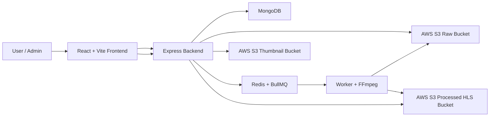

# StreamForge

StreamForge is a full-stack video streaming platform built with React, Node.js, MongoDB, Redis/BullMQ, FFmpeg, and AWS S3. It supports multipart video uploads, background transcoding, HLS playback, user libraries, permanent AWS cleanup, idempotent uploads, and an admin operations dashboard.

## Highlights

- Direct-to-S3 multipart video uploads with thumbnail upload.
- Redis/BullMQ job queue for asynchronous video processing.
- FFmpeg-based HLS transcoding into `.m3u8` playlists and `.ts` segments.
- Private/S3-backed thumbnail and video access through backend-generated URLs.
- Upload lifecycle states: `queued`, `processing`, `ready`, `failed`, and `deleting`.
- Idempotent upload sessions to prevent duplicate videos/jobs during retries or double submits.
- Permanent video deletion from MongoDB and AWS raw, thumbnail, and processed buckets.
- Admin dashboard for users, videos, upload sessions, queue jobs, failed processing, and storage health.
- Route-level lazy loading and dynamic HLS loading reduced the initial JavaScript payload by **63.7%**.

## Architecture



### Upload Flow

1. The frontend requests signed multipart upload URLs from the backend.
2. The browser uploads the raw video and thumbnail directly to AWS S3.
3. The backend creates a `queued` video record and adds a BullMQ job.
4. The worker downloads/processes the raw video with FFmpeg.
5. The worker uploads HLS files to the processed bucket and marks the video `ready`.
6. The frontend plays the processed HLS stream through the custom player.

### Delete Flow

1. The backend verifies ownership or admin access.
2. Related user-list records are removed from MongoDB.
3. The thumbnail object is deleted from the thumbnail bucket.
4. The raw video object is deleted from the raw bucket if it still exists.
5. The processed HLS prefix is deleted from the processed bucket, including all `.m3u8` and `.ts` files.
6. The video document is removed from MongoDB.

## Features

- JWT cookie-based authentication.
- Video upload with thumbnail selection.
- My Channel page with processing status badges.
- Home, search, library, history, profile, and video detail pages.
- Custom HLS video player with buffered progress display.
- Watch history, likes, watch later, channel metadata, and view counting.
- Profile and channel customization with avatar colors.
- User-side deletion for ready, queued, processing, and failed videos.
- Admin role protection and admin dashboard.
- Admin video deletion using the same storage cleanup path as user deletion.

## Tech Stack

| Area | Tools |
| --- | --- |
| Frontend | React, Vite, React Router, CSS Modules, HLS.js, react-hot-toast |
| Backend | Node.js, Express, MongoDB, Mongoose, JWT, bcrypt |
| Processing | Redis, BullMQ, FFmpeg |
| Storage | AWS S3 raw, thumbnail, and processed buckets |
| Tooling | Vite production build, route-level code splitting |

## Production Engineering Decisions

- **Direct S3 uploads:** large video files do not pass through the backend process, reducing API server load.
- **Idempotent upload sessions:** retrying or double-clicking upload does not create duplicate videos or duplicate processing jobs.
- **Async transcoding pipeline:** uploads complete quickly while CPU-heavy FFmpeg work runs in a worker.
- **Visible processing states:** users can see queued/processing/failed uploads immediately in My Channel.
- **Ready-only public feeds:** Home, search, and playback routes only expose videos that finished processing.
- **Best-effort AWS cleanup:** missing S3 objects are logged but do not block database cleanup.
- **Admin dashboard without deep S3 scans:** v1 uses DB-level health checks to keep dashboard calls fast and predictable.
- **Code splitting:** admin, auth, video player, and user routes are lazy-loaded so the home page ships less JavaScript.

## Performance Optimization

Route-level code splitting and dynamic HLS loading were added to reduce the initial home-page bundle.

| Metric | Before | After | Improvement |
| --- | ---: | ---: | ---: |
| Initial JavaScript | 938,501 B | 340,788 B | 63.7% smaller |
| Initial JavaScript gzip | 295.22 KB | 112.68 KB | 61.8% smaller |

Resume-ready summary:

> Reduced initial JavaScript payload by 63.7% using route-level code splitting and dynamic HLS loading.

## Environment Variables

Create `Backend/.env` with the following values:

```env
MONGO_URI=your_mongodb_connection_string
JWT_SECRET=your_jwt_secret

AWS_REGION=your_aws_region
AWS_ACCESS_KEY_ID=your_aws_access_key_id
AWS_SECRET_ACCESS_KEY=your_aws_secret_access_key
AWS_RAW_BUCKET_NAME=your_raw_video_bucket
AWS_THUMBNAILS_BUCKET_NAME=your_thumbnail_bucket
AWS_PROCESSED_BUCKET_NAME=your_processed_hls_bucket
```

Never commit real AWS keys, MongoDB credentials, or JWT secrets.

## Local Setup

Install dependencies:

```bash
npm install
cd Frontend
npm install
cd ../Backend
npm install
```

Start Redis locally on:

```text
127.0.0.1:6379
```

Seed the local admin account:

```bash
cd Backend
npm run seed:admin
```

Start the frontend, backend, and worker together from the repository root:

```bash
npm start
```

Local services:

| Service | URL / Process |
| --- | --- |
| Frontend | `http://localhost:5173` |
| Backend | `http://localhost:3000` |
| Worker | `Backend/worker.js` |

## Admin Access

For local development, seed and log in with:

```text
Email: admin@gmail.com
Password: 123456
```

Admin routes are protected by JWT auth and require the user role to be `admin`.

## Verification

Frontend production build:

```bash
cd Frontend
npm run build
```

Backend syntax checks:

```bash
node --check Backend/app.js
node --check Backend/worker.js
```

Manual end-to-end checklist:

- Upload a video and thumbnail.
- Confirm the new video appears in My Channel as `Queued` or `Processing`.
- Confirm the video becomes playable after processing completes.
- Confirm Home/search only show `ready` videos.
- Delete a video and confirm MongoDB records and S3 objects are cleaned up.
- Log in as admin and inspect users, videos, jobs, upload sessions, and storage health.
